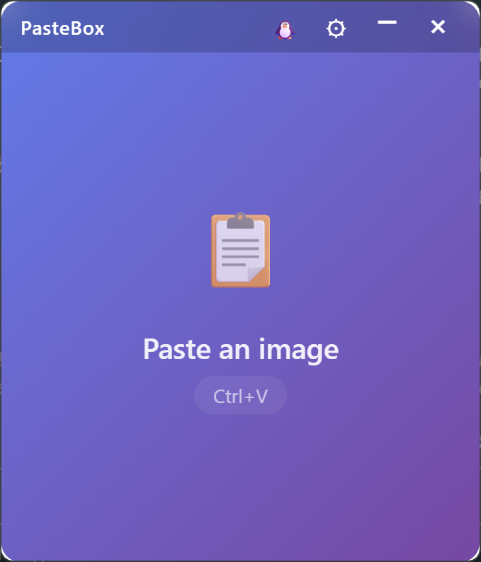

# PasteBox 📋

A lightweight Windows desktop app built with Tauri that lets you paste images from your clipboard, automatically save them to your Downloads folder, and drag them into other applications.

<p align="center"></p>

## Features

- ✨ **Clipboard Image Paste**: Press Ctrl+V to paste an image from the clipboard
- 💾 **Auto-Save**: Saves images to your Downloads folder as `pastebox-[timestamp].png`
- 📋 **Copy File Path**: The saved file's path is copied to the clipboard automatically
- 🐧 **Windows / WSL Paths**: One-click titlebar toggle copies the path as `C:\Users\...` or `/mnt/c/Users/...`
- 📐 **Auto-Resize**: Optional max width; wider images are resized before saving
- 🎯 **Drag & Drop**: Drag the saved image into other apps (Slack, Discord, File Explorer, ...)
- ⚙️ **Persistent Settings**: Max width and clipboard path prefix are remembered between sessions
- 🎨 **Clean UI**: Small frameless 300×350 window with a custom titlebar

## Tech Stack

- **Frontend**: React 19 + TypeScript + Vite
- **Backend**: Rust + Tauri 2 (`image`, `base64`, `chrono`; clipboard-manager, fs, and store plugins)

## How It Works

1. `src/App.tsx` listens for Ctrl+V, reads the clipboard image, and sends it to the backend as base64.
2. The Rust `save_image` command (`src-tauri/src/lib.rs`) decodes it, resizes it if a max width is set, and writes it to Downloads.
3. The frontend copies the file path (Windows or WSL format, see `src/utils.ts`) to the clipboard and shows a draggable preview.

## Running Locally

Prerequisites: Node.js 18+, Rust (stable), and the Windows build tools. Run from PowerShell:

```powershell
npm install
npm run tauri:dev     # development, with hot reload
npm run tauri:build   # installer in src-tauri/target/release/bundle/
```

Note the colon: `tauri:dev`, not `tauri dev`.

## Development Notes

See [DEVELOPMENT_CHALLENGES.md](DEVELOPMENT_CHALLENGES.md) for the problems hit while building this (window dragging, image resizing, window controls, and more) and how each was solved.

## Ideas

- Global shortcut to open PasteBox from anywhere
- Image history / gallery
- More output formats (JPG, WebP)
